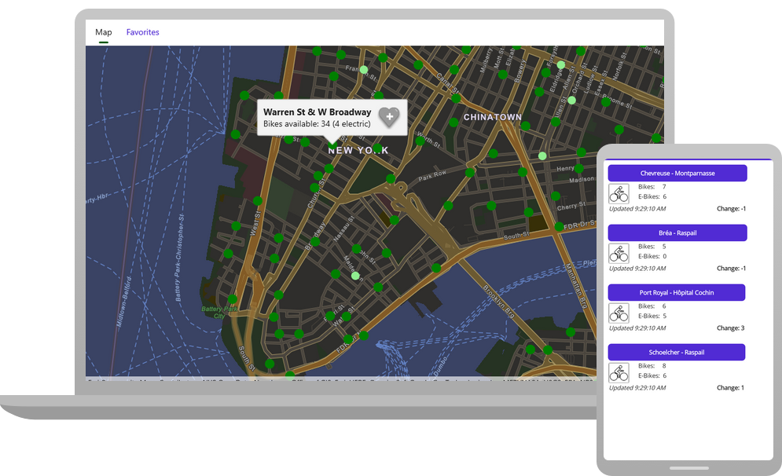

# Bike availability

A .NET MAUI application that use ArcGIS Maps SDK for .NET to show bike availability at rental stations in a few major cities.

This app uses a custom dynamic entity data source to periodically poll the [CityBikes API](http://api.citybik.es/) for bike availability updates. See the blog [Create a custom dynamic entity data source]() for more information.

### To get started:
1. Ensure that your system meets the [System requirements](https://developers.arcgis.com/net/reference/system-requirements/) for ArcGIS Maps SDK for .NET.
1. Clone this repo to your local machine.
1. Open the Visual Studio project (BikeAvailability.csproj).
    - The required NuGet packages will be restored, including ArcGIS Maps SDK for .NET.
1. Add an API key on [line 37 of _MauiProgram.cs_](https://github.com/ThadT/bike-rental-stations-maui/blob/main/MauiProgram.cs#L37).
    - Visit [developers.arcgis.com](https://developers.arcgis.com/sign-up/) to sign up for a free ArcGIS Developer account and to receive an API key.